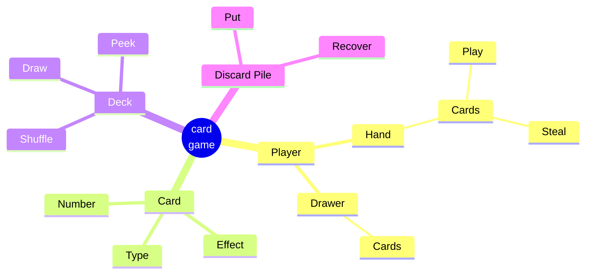

# plai website
The repository contains the code used for the plai website. 
Current features:

* Landing page 
* Game (in development)

## Multiple languages

We are using [fluent templates](https://projectfluent.org/) to support multiple languages
in a more natural-sounding translation. 
For example supporting different genders and gramatical cases (for plural for example).

This is done via `leptos-fluent` package and translations can be found inside `locales/` dir.

## Wishes

I would love to have web analytics capabilities integrated within leptos. 
Currently I'm using [plausible](https://plausible.io/), an 
_Easy to use and privacy-friendly Google Analytics alternative_ that can be self-hosted,
but some of the tracking script collides with some leptos automations (e.g. `ActionForm`).

So ideally I would like to integrate it within leptos for:

* pageviews ✔️
* Link clicks✔️
* Button/Form clicks 
* Page scroll %
 * Bottom of page ✔️
* Time in page
* Active elements ✔️

Some links: 

* [Events API reference](https://plausible.io/docs/events-api)
* [plausible-rs](https://github.com/goddtriffin/plausible-rs) Missing self-hosted support and automatic IP and user_agent. Probably need to obtain them from [`web-sys`](https://docs.rs/web-sys/latest/web_sys/struct.Navigator.html#method.user_agent)


Flashy things and CSS libraries that I do not know much:

* [Implementing a WebAssembly WebGL viewer using Rust](https://julien-decharentenay.medium.com/implementing-a-webassembly-webgl-viewer-using-rust-a6d8a703153d)
* [Leptos text animations](https://paulwagener.github.io/leptos_animation/text)
* [TailwindCSS animation gallery](https://animation.ibelick.com/)
* [CSS transitions](https://www.joshwcomeau.com/animation/css-transitions/) plus [cubic-bezier](https://cubic-bezier.com)
* [heroicons](https://heroicons.com/) SVG icons
* [DaisyUI components](https://daisyui.com/)
* [Aceternity animations](https://ui.aceternity.com/)
* [SVGrepo](https://www.svgrepo.com/collection/lets-duotone-glyph-icons/4)

```javascript
/** @type {import('tailwindcss').Config} */
module.exports = {
    devtool: "source-map",
    content: {
      files: ["*.html", "./src/**/*.rs"],
    },
    theme: {
      extend: {},
    },
    plugins: [
      require("@tailwindcss/typography"), 
      require("daisyui"),
    ],
    daisyui: {
      themes: ["light", "business"],
    }
  }
```


And, train an algorithm to evaluate the balance and play against players:
[RL Card](https://rlcard.org/index.html)


Implement better deserialization with [rkyv](https://rkyv.org/rkyv.html) (uses zero copy which is faster ane memory efficient) (see an example https://github.com/leptos-rs/leptos/discussions/581) 



## Examples and inspirations

[hive - a web game built with rust and leptos](https://github.com/hiveboardgame/hive/tree/main) [web](https://hivegame.com/)


# Leptos Axum Starter Template

This is a template for use with the [Leptos](https://github.com/leptos-rs/leptos) web framework and the [cargo-leptos](https://github.com/akesson/cargo-leptos) tool using [Axum](https://github.com/tokio-rs/axum).

## Creating your template repo

If you don't have `cargo-leptos` installed you can install it with

```bash
cargo install cargo-leptos
```

Then run
```bash
cargo leptos new --git leptos-rs/start-axum
```

to generate a new project template.

```bash
cd plaicards
```

to go to your newly created project.  
Feel free to explore the project structure, but the best place to start with your application code is in `src/app.rs`.  
Addtionally, Cargo.toml may need updating as new versions of the dependencies are released, especially if things are not working after a `cargo update`.

## Running your project

```bash
cargo leptos watch
```

## Installing Additional Tools

By default, `cargo-leptos` uses `nightly` Rust, `cargo-generate`, and `sass`. If you run into any trouble, you may need to install one or more of these tools.

1. `rustup toolchain install nightly --allow-downgrade` - make sure you have Rust nightly
2. `rustup target add wasm32-unknown-unknown` - add the ability to compile Rust to WebAssembly
3. `cargo install cargo-generate` - install `cargo-generate` binary (should be installed automatically in future)
4. `npm install tailwindcss`


## Compiling for Release
```bash
cargo leptos build --release
```

Will generate your server binary in target/server/release and your site package in target/site

## Testing Your Project
```bash
cargo leptos end-to-end
```

```bash
cargo leptos end-to-end --release
```

Cargo-leptos uses Playwright as the end-to-end test tool.  
Tests are located in end2end/tests directory.

## Executing a Server on a Remote Machine Without the Toolchain
After running a `cargo leptos build --release` the minimum files needed are:

1. The server binary located in `target/server/release`
2. The `site` directory and all files within located in `target/site`

Copy these files to your remote server. The directory structure should be:
```text
plaicards
site/
```
Set the following environment variables (updating for your project as needed):
```text
LEPTOS_OUTPUT_NAME="plaicards"
LEPTOS_SITE_ROOT="site"
LEPTOS_SITE_PKG_DIR="pkg"
LEPTOS_SITE_ADDR="127.0.0.1:3000"
LEPTOS_RELOAD_PORT="3001"
```
Finally, run the server binary.

## Licensing

This template itself is released under the Unlicense. You should replace the LICENSE for your own application with an appropriate license if you plan to release it publicly.
